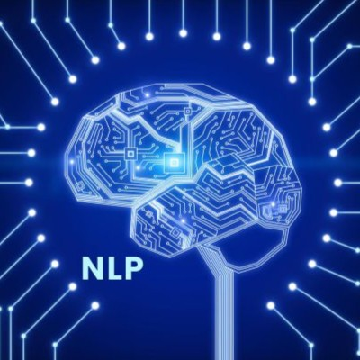
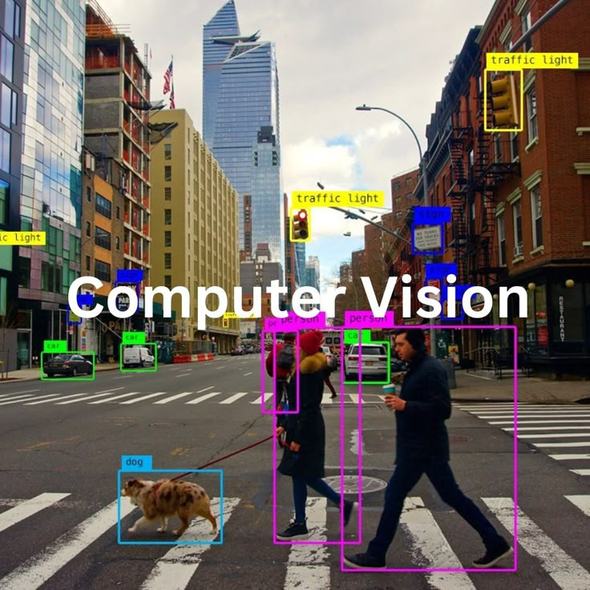
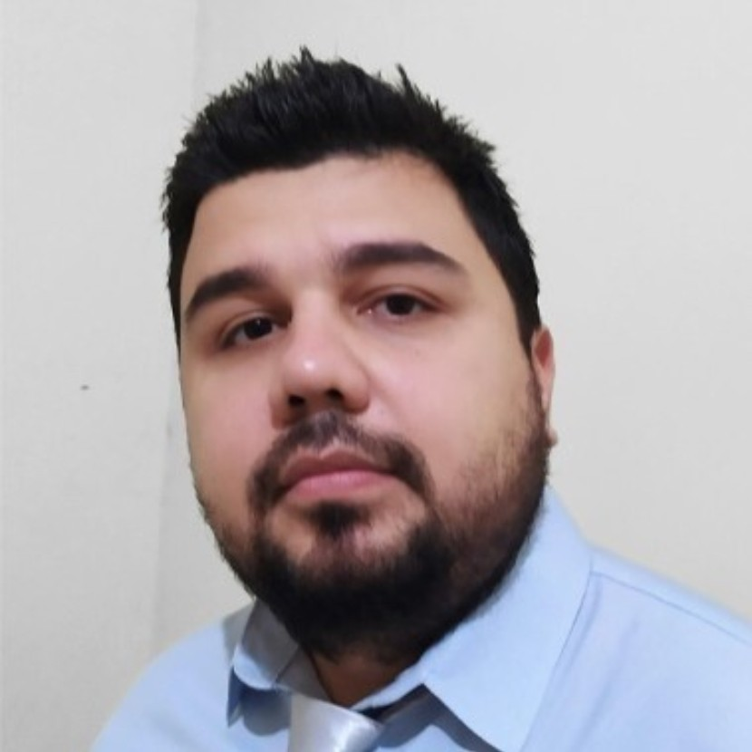
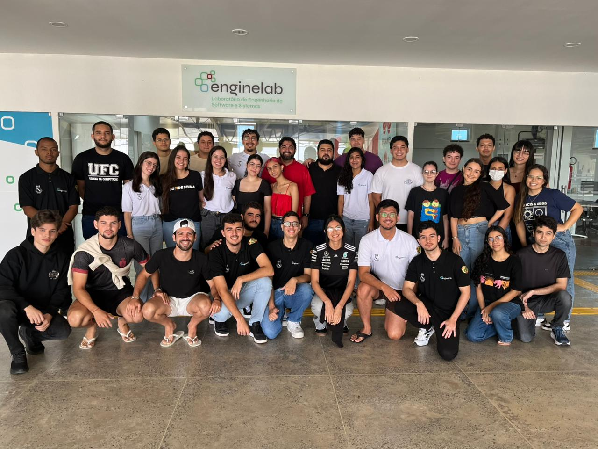

# 🔬 EngineLab - Laboratório de Engenharia de Software e Sistemas

**Pesquisa, Inovação e Desenvolvimento**

---

## 📋 Sobre o Laboratório

O **EngineLab** é um laboratório de pesquisa localizado na Universidade Federal do Ceará (UFC) — Campus Crateús, com foco no desenvolvimento de soluções inovadoras em Inteligência Artificial e sistemas computacionais. O laboratório atua em pesquisa, desenvolvimento e inovação tecnológica, promovendo projetos acadêmicos e científicos que buscam gerar impacto na sociedade e contribuir para a formação de pesquisadores qualificados.

## 🎯 Áreas de Pesquisa

<table>
<tr>
<td width="33%" align="center">

<h3>Processamento de Linguagem Natural</h3>

Pesquisa e desenvolvimento de aplicações com Large Language Models (LLMs).

<a href="projetos/Processamento%20de%20Linguagem%20Natural.md"><b>Ver Projetos →</b></a>
</td>

<td width="33%" align="center">

<h3>Internet das Coisas</h3>

Desenvolvimento de sistemas embarcados, sensoriamento remoto e soluções conectadas.

<a href="projetos/Internet%20das%20Coisas.md"><b>Ver Projetos →</b></a>
</td>

<td width="33%" align="center">

<h3>Visão Computacional</h3>

Reconhecimento de padrões, análise de imagens médicas e aprendizado profundo aplicado.

<a href="projetos/Visão%20Computacional.md"><b>Ver Projetos →</b></a>
</td>
</tr>
</table>

Também desenvolvemos projetos em **[Desenvolvimento de Sistemas](projetos/Desenvolvimento%20de%20Sistemas.md)**, aplicando boas práticas de engenharia de software.

## 👥 Coordenação

<table>
<tr>
<td align="center" width="50%">

<h4>Prof. Dr. Wellington Franco</h4>

<i>Coordenador</i>

<a href="mailto:wellington@crateus.ufc.br">📧 wellington@crateus.ufc.br</a>

</td>

<td align="center" width="50%">

<h4>Prof. Dr. Marciel Barros</h4>

<i>Coordenador</i>

<a href="mailto:marciel@crateus.ufc.br">📧 marciel@crateus.ufc.br</a>

</td>

<td align="center" width="50%">

<h4>Prof. Dr. Bruno Riccelli️️️</h4>

<i>Coordenador</i>

<a href="mailto:bruno.silva@crateus.ufc.br">📧 bruno.silva@crateus.ufc.br</a>

</td>
</tr>
</table>

## 📚 Produção Científica

### Publicações Recentes

| Ano | Título | Autores | Venue | Links |
|-----|--------|---------|-------|-------|
| 2026 | [LLM4Series: Structured Prompting for Time Series Forecasting with LLMs | Silva, Wesley Barbosa | WorKshop TSALM no ICLR 2026 | [📄 PDF](https://openreview.net/forum?id=6fbcYFRoUL) |
| 2024 | [Sex Estimation from 3D Analysis of Paranasal Sinuses: A Multicenter Study Using Deep Learning and Machine Learning] | Scarcela, Maria Fernanda AF. | ENIAC 2025 | [📄 PDF](https://sol.sbc.org.br/index.php/eniac/article/view/38877) |
| 2023 | [Prompt-Driven Time Series Forecasting with Large Language Models] | Bastos, Zairo | ICEIS 2025 | [📄 PDF]((https://www.scitepress.org/Papers/2025/133638/133638.pdf)) |

**[Ver todas as publicações →](publicações/artigos.md)**

### Estatísticas

| 📄 Artigos Publicados | 🎓 TCCs Orientados | 👥 Membros Ativos | 🏆 Prêmios |
|:---:|:---:|:---:|:---:|
| **15+** | **20+** | **40+** | **5** |

## 🎓 Trabalhos de Conclusão de Curso

Nossos alunos desenvolvem TCCs de alta qualidade aplicando pesquisa em problemas reais. 

**[Ver todos os TCCs desenvolvidos →](tccs/tccs.md)**

### Destaques Recentes

- **[2026]** *Carcará: sistema para integração de dados meteorológicos e hidrológicos no semiárido brasileiro* - Mikael Sales | [📂 Repositório](https://repositorio.ufc.br/handle/riufc/84644)
- **[2025]** *Previsão de séries temporais orientada por prompt com modelos de linguagem de grande escalas* - Zairo Bastos | [📂 Repositório](https://repositorio.ufc.br/handle/riufc/80020)
- **[2025]** *Um estudo comparativo de modelos de aprendizado de máquina para classificação de flores apícolas: integrando extratores de texturas e classificadores* - Letícia Torres | [📂 Repositório](https://repositorio.ufc.br/handle/riufc/79979)

## 🤝 Parcerias

<table>
<tr>
<td align="center" width="20%">

<b>Kunumi Lab</b>

</td>
<td align="center" width="25%">

<b>CIDTS - IFCE campus Boa Viagem</b>

</td>
</tr>
</table>

## 🛠️ Tecnologias que Utilizamos

## 📞 Contato

- 🌐 **Website:** [enginelab.ufc.br](https://enginelab.ufc.br/)
- 📧 **Email:** enginelab@crateus.ufc.br
- 📱 **Instagram:** [@enginelab](https://www.instagram.com/enginelab.ufc/)
- 📍 **Localização:** Universidade Federal do Ceará - Campus Crateús

---

**Feito com ❤️ pelo EngineLab**

*Transformando ideias em soluções tecnológicas*

